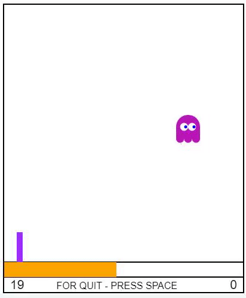
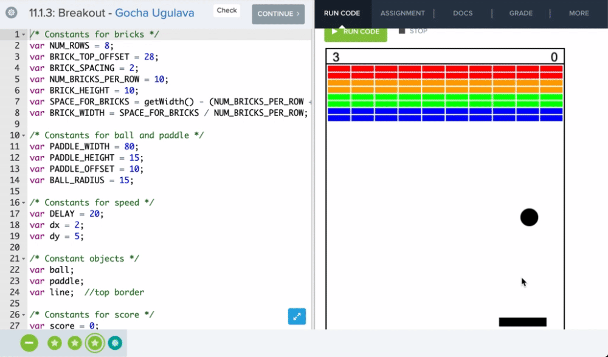

# CodeHS_BitCamp_stage1
games on JavaScript
  
<h3>Game: Kill Ghost</h3> 

The game field is a rectangle along which the ghost moves with random speed. Reflected from the walls it changes speed, 
direction of movement and color each time - choosing these parameters randomly. Below there is a gun in the left corner that 
shoots single balls. The goal is to hit the ghost with a shot. The next shot is fired after the previous ball leaves the playing 
field. Horizontal movement of the mouse controls the power of the shot (the speed of the ball), which is displayed at the bottom
of the playing field with an orange strip. Vertical movement of the mouse adjusts the angle of the gun. During the flight of 
the ball, the control does not respond. The shot is made by a mouse click. Points are awarded for every ghost killed. The goal
of the game is to hit as many ghosts as possible with the given number of balls (shots) and get more points. The number of points 
and remaining shots are displayed at the bottom of the playing field. You can exit before the game is completed by pressing the 
space key.

 

<h3>Game: Breakout</h3> 

 

 The game breakout has long been a classic. Reflecting the ball with a paddle, we try to knock out all the bricks. 
For each destroyed brick points are awarded. A ball should not fly down, otherwise life is lost. In total, the player 
has three lives. Control is carried out with the mouse. Pause/Continuation - mouse click.
  

The games was written in the CodeHS JavaScript Library in the CodeHS editor, and then, using the special CodeHS 
library, it was automatically converted for external use. 

The full documentation of editor - by visiting codehs.com/docs  

Short documentation is in the file  CodeHS.pdf 

Completed CodeHS full course: "Introduction to Computer Science in JavaScript" got
<a href="https://codehs.com/certificate/NgjDiT" target="_blank">Certificate (Golden) </a>  
